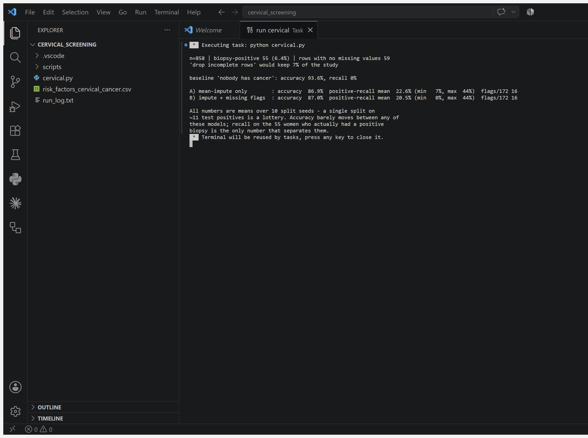

# Cervical Cancer Screening — the model that lost to "nobody has cancer" 🎗️

**Guessing that no one is sick scores 93.6%. My model scores 87%.** That is the
result, and I am publishing it rather than tuning until a nicer number appears.

| Strategy | Accuracy | Recall on positives (mean of 10 seeds) |
|---|---|---|
| baseline: predict "nobody has cancer" | **93.6%** | **0%** |
| A) mean-impute missing values | 86.9% | 22.6% (range 7–44%) |
| B) impute + explicit missingness flags | 87.0% | 20.5% (range 0–44%) |

Accuracy went *down* and still only ~1 in 5 women with a positive biopsy get
flagged. On this data, from these questionnaire answers, the honest answer is:
**this does not work well enough to screen anyone.**

## The problem

UCI [Cervical Cancer (Risk Factors)](https://archive.ics.uci.edu/dataset/383/cervical+cancer+risk+factors):
858 patients at Hospital Universitario de Caracas, 36 columns, target is the
biopsy result. Cervical cancer kills roughly 350,000 women a year, most in
places where screening is scarce — so a questionnaire-based triage model is a
genuinely appealing idea. That is exactly why it deserves a hostile evaluation.

Three properties make this dataset a minefield:

1. **799 of 858 rows (93%) have at least one missing answer.** "Drop rows with
   missing values" — the reflex in many tutorials — keeps **7% of the study**.
   59 patients. That is not a dataset, it is an anecdote.
2. **Two columns are 92% missing** (time since STD diagnosis). Patients skip
   intimate questions non-randomly, so the hole carries information. Strategy B
   tests whether feeding that pattern to the model helps. **It didn't** —
   recall got slightly worse. Worth reporting; a plausible idea that fails is
   still a result.
3. **Only 55 positives (6.4%).** Accuracy is meaningless here, which is why the
   do-nothing baseline wins on it.

## Also excluded: three more leaky columns

`Hinselmann`, `Schiller`, and `Citology` are *other test outcomes*, not risk
factors. Including them would be the same target-leakage mistake as
[birthweight-leakage-pytorch](https://github.com/sravanni369/birthweight-leakage-pytorch),
where the birth weight itself sat in the feature table. Dropped here before
training.

## Why I trust the negative result

Every number is a mean over **10 split seeds**. With ~11 positives in a test
set, a single split proves nothing — the same lesson that showed up as a
38.5–100% recall swing in the birth-weight project. The spread is printed
alongside each mean so you can see how wide it is (7–44%).

## Run it

```bash
pip install torch
python cervical.py
```

stdlib + PyTorch only, CPU, about a minute. Full unedited output in
[`run_log.txt`](run_log.txt); the run captured live in VS Code:



## Audit trail

An [evaluation auditor](https://github.com/sravanni369/fizzbuzz-evaluation-traps)
run over this repo after publication flagged two gaps, both now closed:

- **23 of 858 rows (2.7%) are duplicates.** Small enough not to move the
  headline, but it went unchecked in the first version and is stated here rather
  than left implicit.
- **A negative result was published without a convergence check.** Training loss
  is now printed on every run (0.110 and 0.082). Re-running at 2,000 epochs
  instead of 300 gives 88.5% accuracy and 22.1% recall — still below the 93.6%
  baseline, still catching about one positive in five. **The conclusion holds**,
  but it now holds with evidence rather than by assumption.

## Honest scope

One hospital, one city, 858 patients. Class-weighted loss deliberately trades
accuracy for recall; without it the model collapses to the do-nothing baseline.
A better attempt would use multiple imputation, cross-validation rather than
repeated hold-outs, and calibrated probabilities with a threshold chosen for
screening (where a false positive costs a follow-up test and a false negative
can cost a life) — I would expect those to help, and I would still expect this
data to be too small and too incomplete for deployment. Nothing here is medical
advice or a screening tool.

**Sources:** dataset — Fernandes, Cardoso & Fernandes (2017), UCI id 383.
MLP and class weighting — [Dive into Deep Learning](https://d2l.ai) ch. 5;
missing-data discussion — [ISLP](https://www.statlearning.com) ch. 4. Adapted,
not transcribed.
